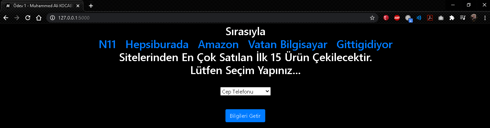
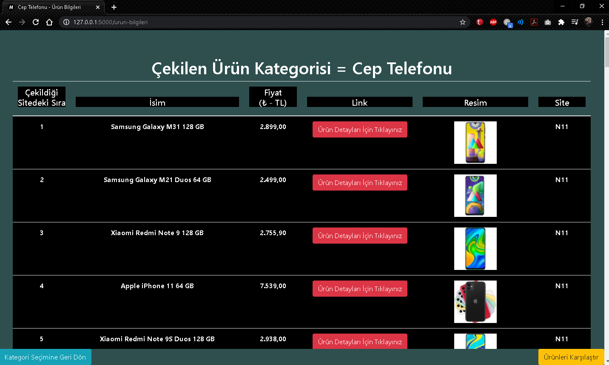
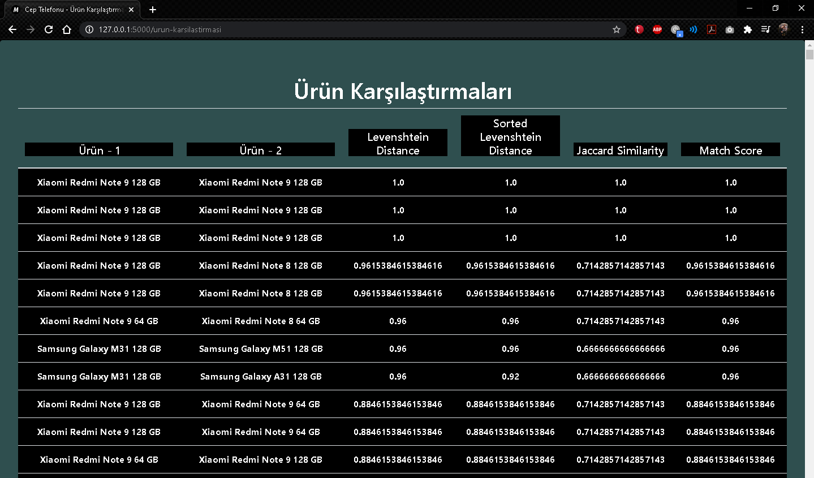

# EN
## N11, Hepsiburada, Amazon, Vatan computer and Gittigidiyor e-commerce sites respectively, scraping the 15 best selling products in the selected category (mobile phone, laptop, tablet) from the website. It then measures the text similarities of these products with some popular text similarity algorithms.
### It displays some information about the products shot in the given category on the website created with Flask.
------------------

Step 1:

Step 2:

Step: 

You can browse my [website](https://www.muhammedalikocabey.com/blog) for more.

For help and questions, go to my mail address [me@muhammedalikocabey.com](mailto:me@muhammedalikocabey.com) you can contact me.
  

# TR
## Sırasıyla N11, Hepsiburada, Amazon, Vatan bilgisayar ve Gittigidiyor e-ticaret sitelerinden seçilen kategorideki (cep telefonu, dizüstü bilgisayar, tablet) en çok satılan 15 ürünü web sitesinden kazıyor. Sonrasında çekilen bu ürünlere ait metin benzerliklerini bazı popüler metin benzerliği algoritmalarıyla ölçüyo
### Verilen kategoride çekilen ürünlere ait bazı bilgileri Flask ile oluşturulmuş web-sitesinde gösteriyor.
------------------

Adım 1:

Adım 2:

Adım3: 

Daha fazlası için [web siteme](https://www.muhammedalikocabey.com/blog) göz atabilirsiniz.

Yardım ve sorularınız için mail adresimden [me@muhammedalikocabey.com](mailto:me@muhammedalikocabey.com) bana ulaşabilirsiniz.
